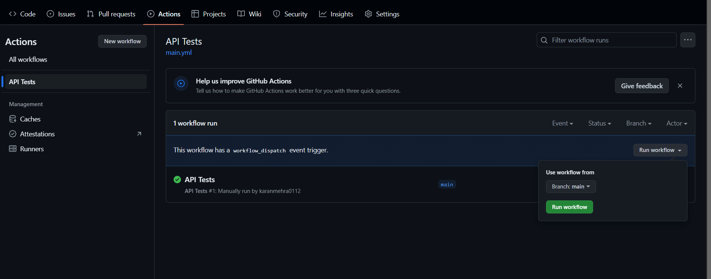
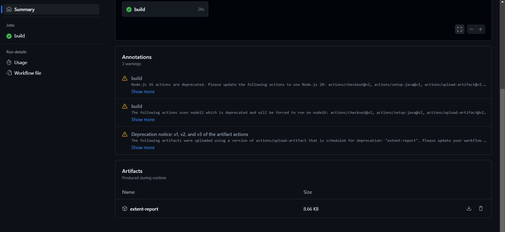

# API Test Project

This is a project demonstrating API testing using RestAssured with TestNg in Java.

## Tools and Technologies Used

- **Java**: Programming language used for writing the tests.
- **RestAssured**: Java library used for making HTTP requests and validating responses.
- **TestNG**: Testing framework used for organizing and running tests.
- **Maven**: Dependency management tool used for managing project dependencies and building the project.
- **ExtentReports**: Library used for generating detailed HTML reports of the test execution.
- **GitHub Actions**: CI/CD tool used for automating the build, test, and deployment pipeline.

## Folder Structure

```
sample-api-test-project/
├── src/
│ ├── main/
│ │ └── java/
│ │ └── com/
│ │ └── assessment/
│ │ ├── config/
│ │ │ └── ConfigLoader.java # Configuration loader class
│ │ ├── api/
│ │ │ └── ApiUtil.java # Utility class for API operations
│ │ └── data/
│ │ └── DataProcessor.java # Class for processing data
│ └── test/
│ └──java/
│ └── com/
│ └── assessment/
│ └── tests/
│ └── GetObjects.java
│ └── resources/
│ └── config.properties # Configuration properties file
├── pom.xml # Maven project configuration file
└── testng.xml # TestNG configuration file
```

- **src/main/java/com/assessment/config**: Contains classes related to configuration, such as `ConfigLoader.java`, responsible for loading configuration properties.
- **src/main/java/com/assessment/api**: Contains utility classes like `ApiUtil.java`, which provides methods for making API requests.
- **src/main/java/com/assessment/data**: Contains classes related to data processing, such as `DataProcessor.java`.
- **src/test/java/com/assessment/tests**: Contains TestNG test classes, like `SampleGetRequest.java`, which contains test methods for sample GET requests.
- **src/test/resources**: Contains resources such as configuration properties file (`config.properties`).
- **pom.xml**: Maven project configuration file specifying dependencies and build settings.
- **testng.xml**: TestNG configuration file defining test suites and test cases.

## Instructions for Running Tests
1. Clone the repository to your local machine.
2. Ensure you have Maven installed on your machine.
3. Open a terminal or command prompt and navigate to the project directory.
4. Run the following command:
   ```
   mvn clean test
   ```
5. After executing the above command, Extent report will be generated in the root directory with the name "extent-reports.html".


## Instructions for Running Tests on GitHub Actions
1. Go to the Actions .
2. Select the workflow.
4. Click on the "Run workflow".




## Instructions for getting extent report
1. Click on the Github Actions tests run.
2. Scroll down the page to Artifacts.
3. Click on the "extent-report".
4. Zip will be downloaded.
5. Extract the zip and open the "extent-reports.html".

